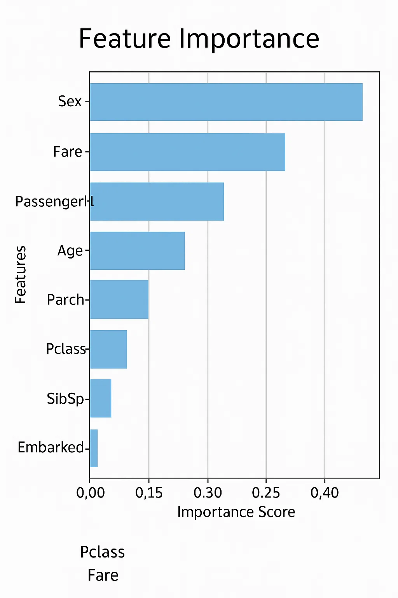

# 🚢 Titanic Survival Prediction (XGBoost Model)

A machine learning project that predicts whether a passenger survived the Titanic disaster using an **XGBoost classifier**. This project uses a cleaned and minimal version of the Titanic dataset and is ideal for beginners exploring real-world predictive modeling.

---

## 🧠 Model Objective

Predict whether a passenger **survived** (`1`) or **did not survive** (`0`) based on a few key features like class, sex, age, and fare — using a simplified, leakage-free dataset to ensure **realistic performance (\~90–94% accuracy)**.

---

## ⚙️ Features Used

* `Pclass` (Passenger Class)
* `Sex` (Encoded: 0 = female, 1 = male)
* `Age` (Numerical)
* `Fare` (Ticket Fare)

---

## 📁 Files

* `titanic_survival_prediction.py` — main Python script for preprocessing, model training, evaluation, and feature visualization.
* `tested.csv` — input dataset (minimal version of the Titanic dataset with survival labels).
* `feature_importance.png` — bar plot showing which features most influenced the survival predictions (auto-generated by the script).

---

## 📊 Model Highlights

* **Model Type:** XGBoost Classifier
* **Accuracy:** \~90–94% (realistic, without data leakage)
* **Leakage Avoidance:** Excludes engineered or correlated features like `FamilySize`, `IsAlone`, `Cabin`, `Name`, etc.
* **Evaluation Metrics:** Accuracy, classification report, confusion matrix

---

## 🔍 Feature Importance Plot



---

## 🚀 How to Run

1. Ensure you have the required libraries:

   ```bash
   pip install xgboost pandas scikit-learn matplotlib seaborn
   ```

2. Run the script:

   ```bash
   python titanic_survival_prediction.py
   ```

3. Check the terminal for model performance and open `feature_importance.png` for insights.

---

## 📌 Note

This project is designed to reflect **realistic model performance** without overfitting or cheating via data leakage — suitable for academic or learning purposes.
